# FinTrackApp - Diagramas Mermaid

Data: 2026-06-08

Este documento descreve as principais iteracoes e fluxos da app em Mermaid. O objetivo e transformar o plano de produto num mapa visual para orientar implementacao, testes e decisoes de UX.

## 1. Ciclo de vida geral

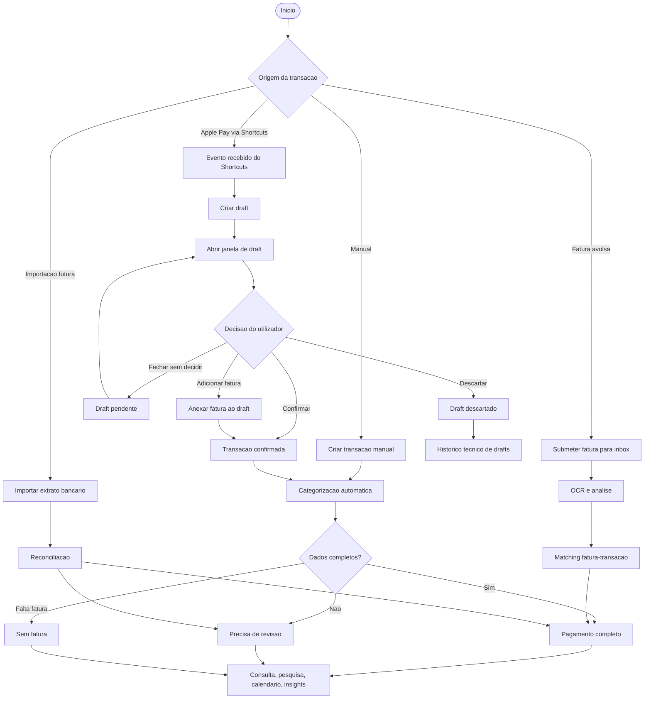

## 2. Evento Apple Pay via Shortcuts

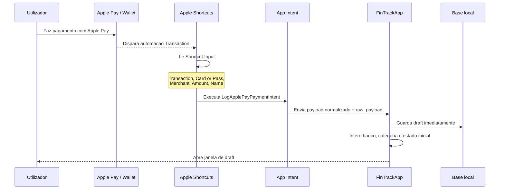

## 3. Janela de draft

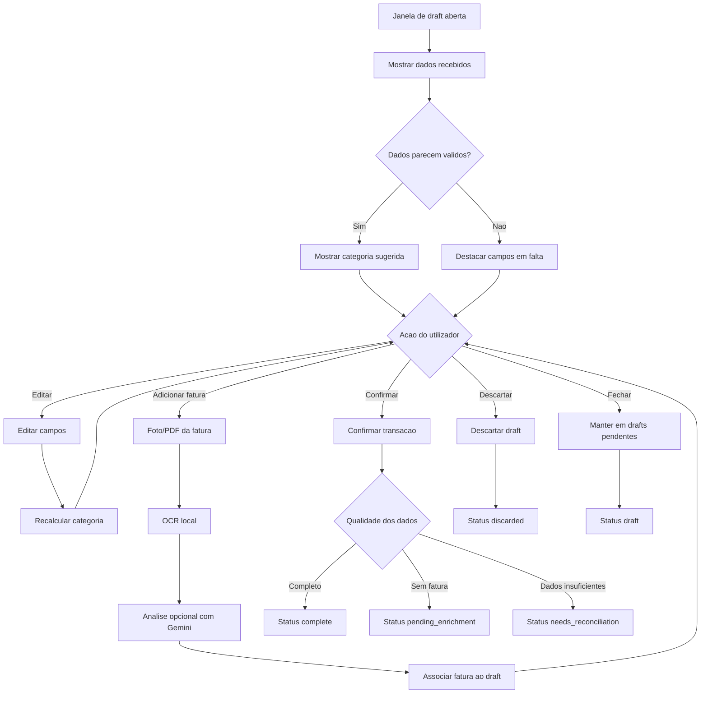

## 4. Transacao manual

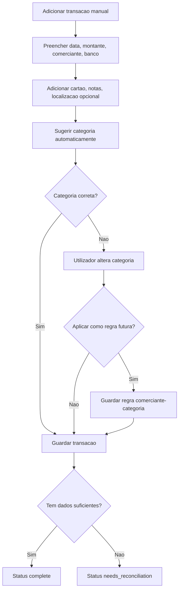

## 5. Inbox de faturas avulsas

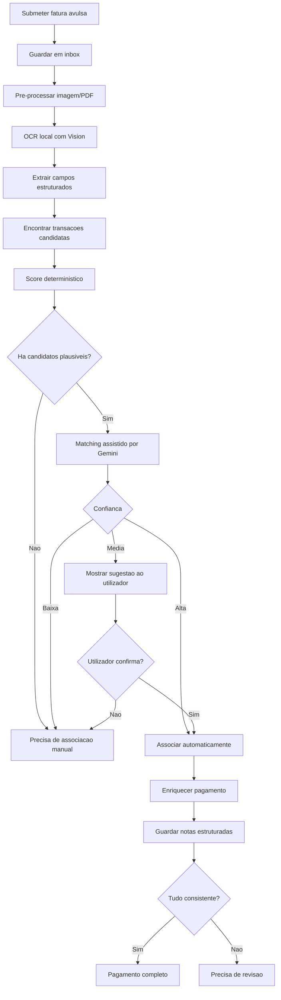

## 6. Matching fatura-transacao

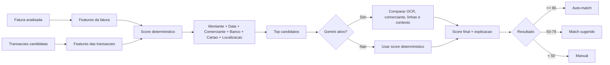

## 7. Categorizacao automatica

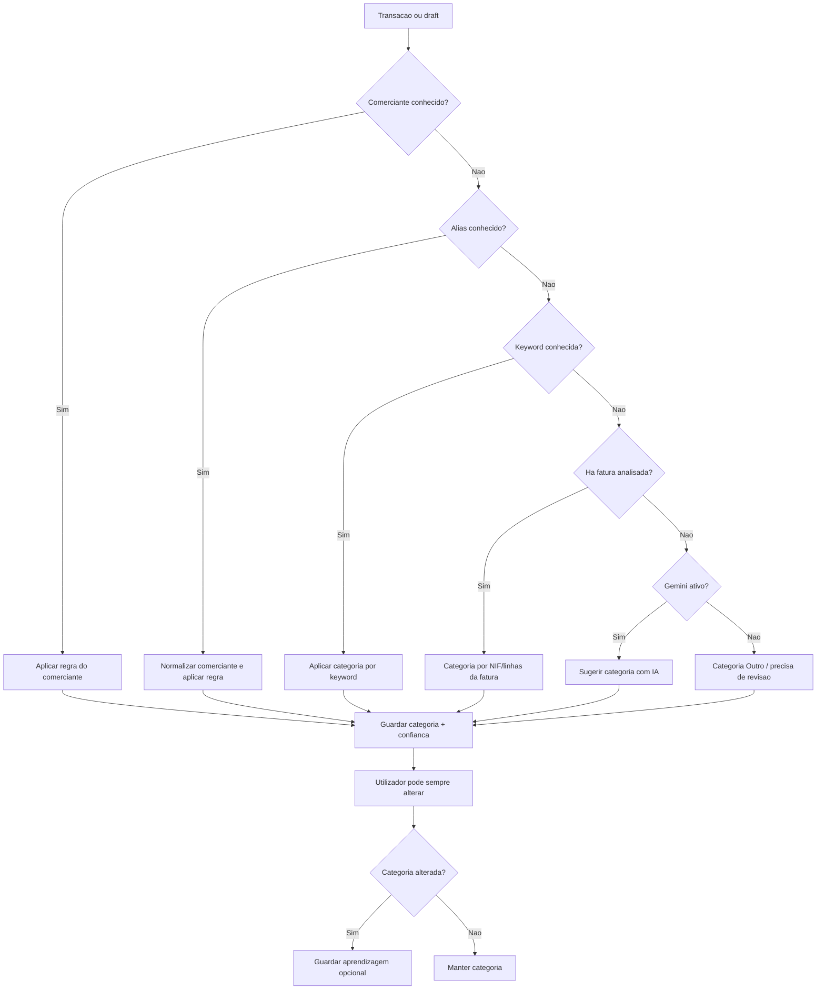

## 8. Estados da transacao

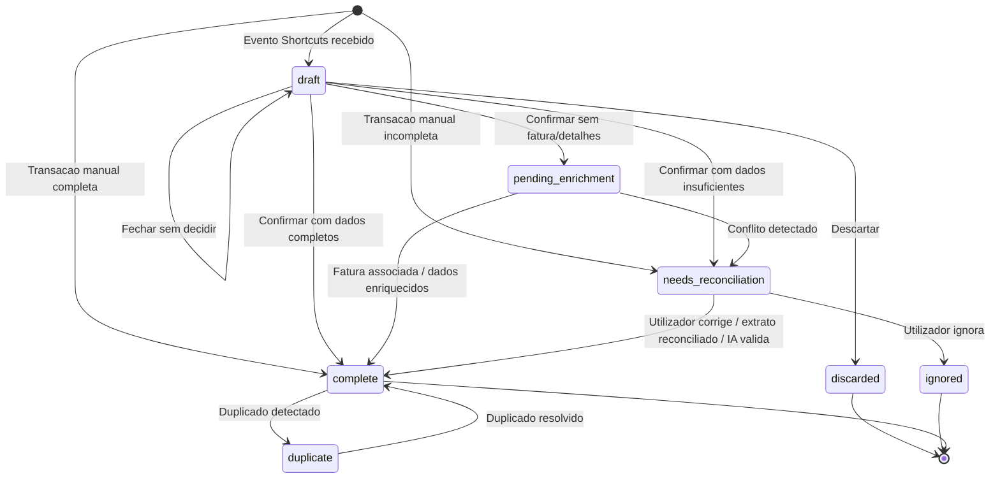

## 9. Pesquisa global

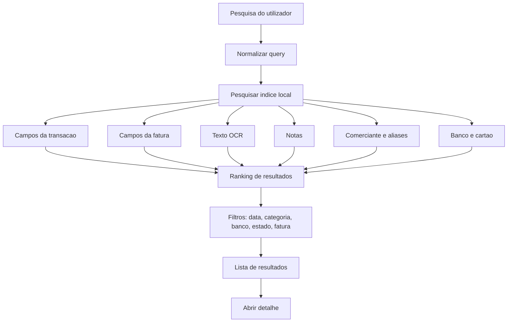

## 10. Vista de calendario

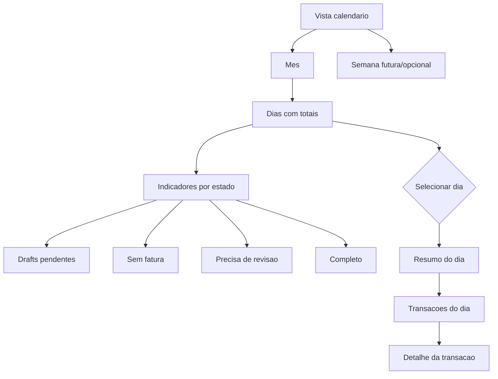

## 11. Gemini API opcional

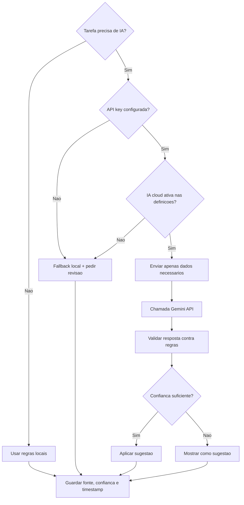

## 12. Modelo de dados

O modelo de dados detalhado, incluindo o diagrama ER Mermaid, vive em `docs/DATA_MODEL.md`.

## 13. Roadmap visual

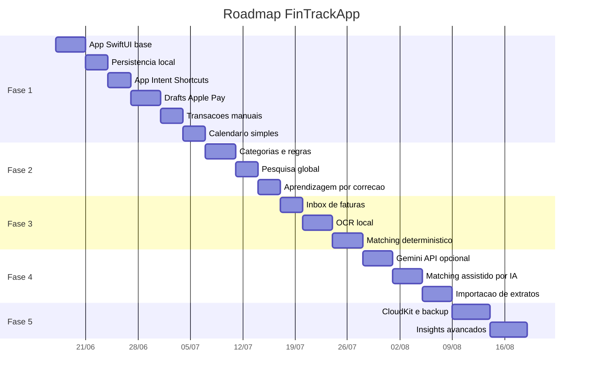
