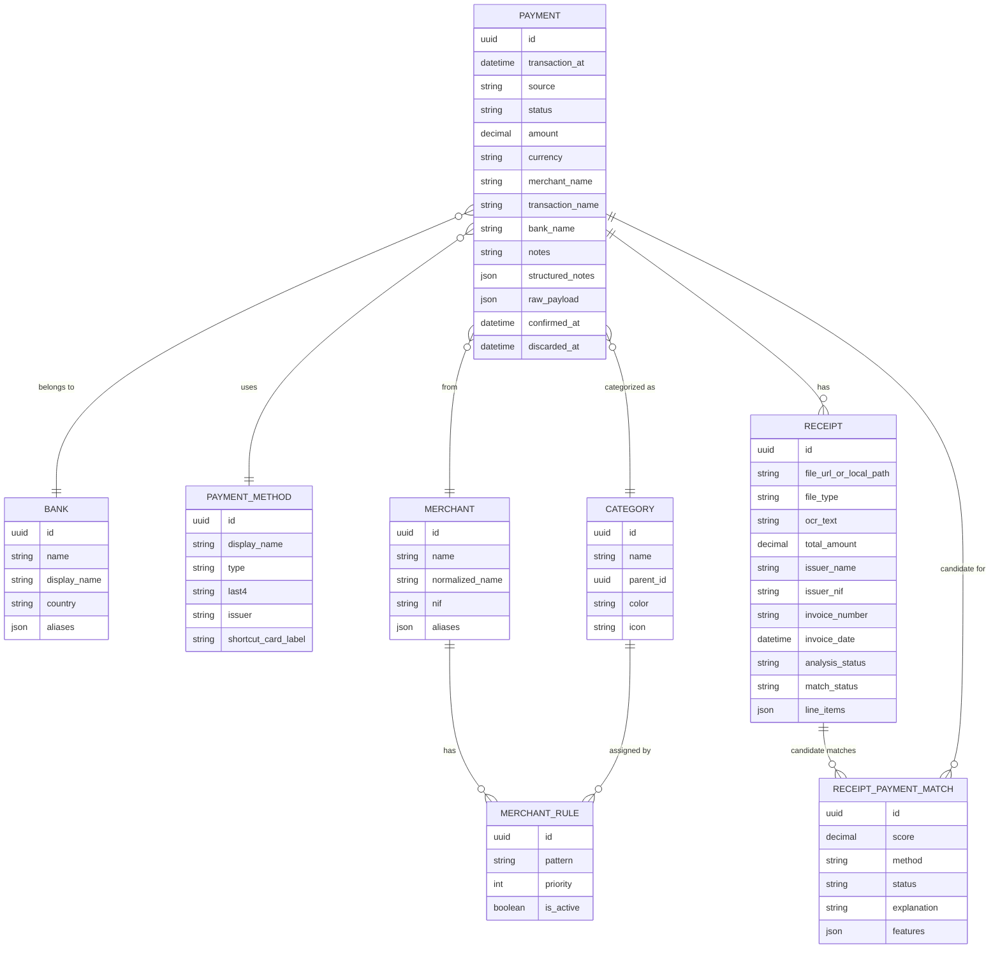

# FinTrackApp - Modelo de Dados

Data: 2026-06-08

Este documento define o modelo de dados funcional da app. A implementacao inicial pode usar SwiftData ou SQLite, mas os conceitos abaixo devem manter-se estaveis independentemente da tecnologia.

## 1. Principios

- A transacao e a entidade central.
- Eventos Apple Pay recebidos pelo Shortcuts entram primeiro como `draft`.
- Uma fatura pode ser submetida sem pagamento associado.
- A associacao fatura-transacao pode ser manual, por regras ou assistida por IA.
- A categoria e sempre sugerida automaticamente, mas sempre editavel.
- O banco e um campo de primeira classe na transacao.
- O `raw_payload` deve ser preservado para debug e auditoria pessoal.

## 2. Entidades

### 2.1 Payment

Representa uma transacao financeira ou um draft vindo do Shortcuts.

Campos:

- `id`: UUID
- `created_at`: timestamp de criacao na app
- `updated_at`: timestamp de ultima alteracao
- `transaction_at`: timestamp estimado ou real da compra
- `source`: `apple_pay_shortcut`, `manual`, `bank_import`, `receipt_match`
- `source_confidence`: 0.0 a 1.0
- `status`: `draft`, `pending_enrichment`, `needs_reconciliation`, `complete`, `ignored`, `duplicate`, `discarded`
- `confirmed_at`: timestamp opcional
- `discarded_at`: timestamp opcional
- `amount`: decimal opcional
- `currency`: texto, default `EUR`
- `merchant_id`: FK opcional
- `merchant_name`: texto opcional
- `merchant_normalized`: texto opcional
- `transaction_name`: texto opcional, vindo do campo `Name` do Shortcuts
- `bank_id`: FK opcional
- `bank_name`: texto opcional para importacoes ou dados ainda nao normalizados
- `category_id`: FK opcional
- `subcategory_id`: FK opcional
- `payment_method_id`: FK opcional
- `location_lat`: decimal opcional
- `location_lon`: decimal opcional
- `location_label`: texto opcional
- `notes`: texto livre
- `structured_notes`: JSON
- `raw_payload`: JSON
- `duplicate_group_id`: UUID opcional
- `review_required`: boolean

Notas:

- `amount` deve ser guardado como decimal, nunca como float.
- `bank_name` existe para preservar dados antes de normalizar para `bank_id`.
- `transaction_name` e separado de `merchant_name` porque o Shortcuts expoe `Name` e `Merchant` como campos distintos.
- Drafts descartados nao devem entrar em totais financeiros normais.

### 2.2 Bank

Representa o banco emissor ou instituicao financeira associada a uma transacao.

Campos:

- `id`: UUID
- `name`: nome canonical
- `display_name`: nome mostrado na UI
- `country`: codigo de pais, default `PT`
- `aliases`: lista de nomes alternativos
- `is_active`: boolean
- `created_at`: timestamp
- `updated_at`: timestamp

Exemplos:

- ActivoBank
- Millennium BCP
- Revolut
- Wise
- moey!
- Santander
- Caixa Geral de Depositos

### 2.3 PaymentMethod

Representa o meio de pagamento concreto, normalmente uma carta no Apple Wallet.

Campos:

- `id`: UUID
- `display_name`: nome mostrado na UI
- `type`: `apple_pay_card`, `bank_card`, `cash`, `other`
- `last4`: ultimos 4 digitos, opcional
- `issuer`: emissor textual, opcional
- `bank_id`: FK opcional
- `shortcut_card_label`: valor vindo de `Card or Pass`
- `is_active`: boolean
- `created_at`: timestamp
- `updated_at`: timestamp

Notas:

- `shortcut_card_label` e usado para mapear automaticamente eventos Apple Pay para banco/metodo de pagamento.
- Uma carta pode ser desativada sem apagar historico.

### 2.4 Merchant

Representa um comerciante normalizado.

Campos:

- `id`: UUID
- `name`: nome canonical
- `normalized_name`: nome normalizado para matching
- `category_id`: FK opcional
- `aliases`: lista
- `nif`: opcional
- `address`: opcional
- `confidence`: confianca da normalizacao
- `created_at`: timestamp
- `updated_at`: timestamp

Notas:

- `Merchant` pode vir do Shortcuts, de fatura, de extrato ou de correcao manual.
- Alterar a categoria de um comerciante pode criar uma regra para transacoes futuras.

### 2.5 Category

Representa categoria ou subcategoria.

Campos:

- `id`: UUID
- `name`: nome
- `parent_id`: FK opcional para categoria pai
- `color`: cor para UI
- `icon`: identificador de icone
- `budget_monthly`: opcional
- `is_system`: boolean
- `created_at`: timestamp
- `updated_at`: timestamp

Categorias iniciais:

- Alimentacao
- Restaurantes e cafes
- Supermercado
- Transporte
- Combustivel
- Saude
- Farmacia
- Casa
- Subscricoes
- Compras pessoais
- Tecnologia
- Lazer
- Viagens
- Impostos e servicos
- Transferencias
- Outro

### 2.6 Receipt

Representa uma fatura, recibo ou comprovativo.

Campos:

- `id`: UUID
- `payment_id`: FK opcional
- `file_url_or_local_path`: path local ou URL interna
- `file_type`: `image`, `pdf`
- `captured_at`: timestamp
- `submitted_at`: timestamp
- `ocr_text`: texto bruto extraido
- `ocr_confidence`: 0.0 a 1.0
- `issuer_name`: comerciante/emissor
- `issuer_nif`: NIF do emissor
- `invoice_number`: numero da fatura
- `invoice_date`: data da fatura
- `total_amount`: decimal opcional
- `currency`: texto, default `EUR`
- `vat_total`: decimal opcional
- `line_items`: JSON
- `analysis_status`: `pending`, `processed`, `failed`, `needs_review`
- `analysis_model`: texto opcional
- `match_status`: `unmatched`, `auto_matched`, `suggested_match`, `manual_matched`, `rejected`
- `match_confidence`: 0.0 a 1.0
- `created_at`: timestamp
- `updated_at`: timestamp

Notas:

- `payment_id` e opcional porque a fatura pode entrar primeiro numa inbox.
- O ficheiro original deve ser preservado.
- O texto OCR deve ser pesquisavel.

### 2.7 ReceiptLineItem

Pode comecar embebido em JSON no `Receipt`. Se a app evoluir para analise mais profunda, passar para tabela propria.

Campos:

- `id`: UUID
- `receipt_id`: FK
- `description`: texto
- `quantity`: decimal opcional
- `unit_price`: decimal opcional
- `total_price`: decimal opcional
- `vat_rate`: decimal opcional
- `category_id`: FK opcional
- `created_at`: timestamp
- `updated_at`: timestamp

### 2.8 MerchantRule

Regra de categorizacao baseada em comerciante.

Campos:

- `id`: UUID
- `merchant_id`: FK opcional
- `pattern`: texto ou regex simples
- `category_id`: FK
- `bank_id`: FK opcional
- `priority`: inteiro
- `is_active`: boolean
- `created_from_payment_id`: FK opcional
- `created_at`: timestamp
- `updated_at`: timestamp

### 2.9 ReceiptPaymentMatch

Regista uma tentativa ou decisao de associacao entre fatura e transacao.

Campos:

- `id`: UUID
- `receipt_id`: FK
- `payment_id`: FK
- `score`: 0.0 a 1.0
- `method`: `deterministic`, `gemini`, `manual`
- `status`: `candidate`, `accepted`, `rejected`
- `explanation`: texto opcional
- `features`: JSON
- `created_at`: timestamp

## 3. Enums

### 3.1 PaymentSource

- `apple_pay_shortcut`
- `manual`
- `bank_import`
- `receipt_match`

### 3.2 PaymentStatus

- `draft`
- `pending_enrichment`
- `needs_reconciliation`
- `complete`
- `ignored`
- `duplicate`
- `discarded`

### 3.3 ReceiptAnalysisStatus

- `pending`
- `processed`
- `failed`
- `needs_review`

### 3.4 ReceiptMatchStatus

- `unmatched`
- `auto_matched`
- `suggested_match`
- `manual_matched`
- `rejected`

### 3.5 PaymentMethodType

- `apple_pay_card`
- `bank_card`
- `cash`
- `other`

## 4. Relacoes

## 5. Indices de pesquisa

Campos pesquisaveis:

- `Payment.amount`
- `Payment.currency`
- `Payment.transaction_at`
- `Payment.merchant_name`
- `Payment.merchant_normalized`
- `Payment.transaction_name`
- `Payment.bank_name`
- `Payment.notes`
- `Payment.structured_notes`
- `Payment.raw_payload`, apenas em modo debug
- `Bank.name`
- `Bank.aliases`
- `PaymentMethod.display_name`
- `PaymentMethod.shortcut_card_label`
- `Merchant.name`
- `Merchant.aliases`
- `Merchant.nif`
- `Category.name`
- `Receipt.ocr_text`
- `Receipt.issuer_name`
- `Receipt.issuer_nif`
- `Receipt.invoice_number`
- `Receipt.line_items`

## 6. Regras de integridade

- Uma `Payment` em `complete` deve ter `amount`, `currency`, `transaction_at` e categoria.
- Uma `Payment` em `draft` pode ter campos incompletos.
- Uma `Payment` em `discarded` nao entra em totais, calendario financeiro ou insights.
- Uma `Receipt` pode existir sem `payment_id`.
- Uma `Receipt` com `auto_matched` deve ter `payment_id`.
- Uma `ReceiptPaymentMatch` aceite deve refletir-se em `Receipt.payment_id`.
- Alteracoes manuais do utilizador devem prevalecer sobre sugestoes da IA.
- Sugestoes de IA devem guardar fonte, confianca e explicacao quando disponivel.
